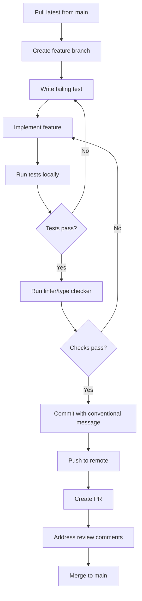
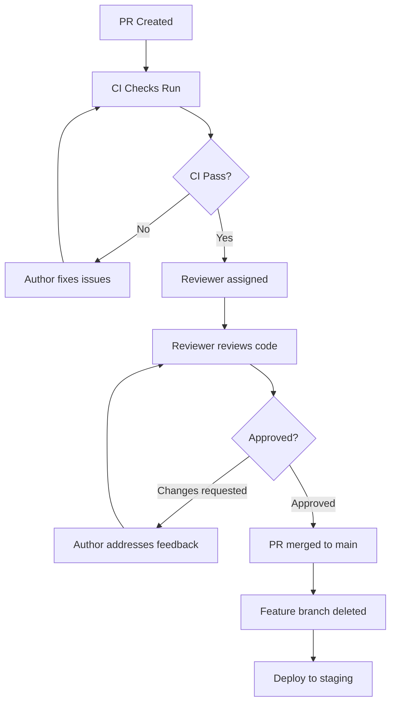
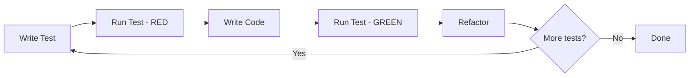
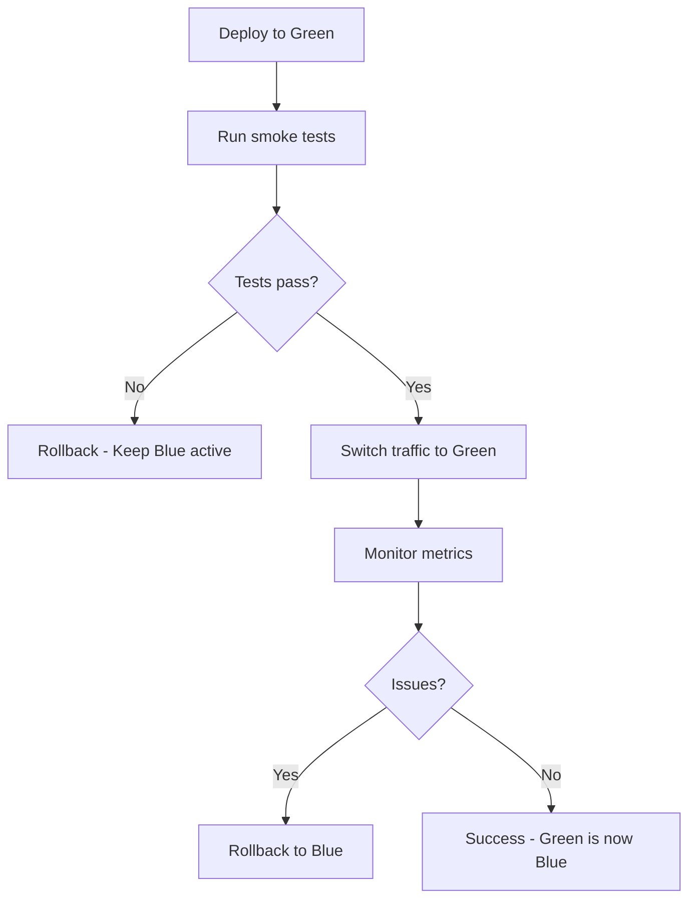
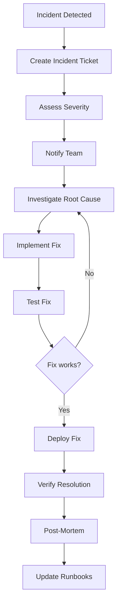

# Workflows: Life Graph Integration
**Version**: 1.0.0
**Date**: 2025-11-06
**Author**: AI Development Team
**Status**: Planning Phase

---

## Table of Contents
1. [Development Workflows](#development-workflows)
2. [Git Workflow](#git-workflow)
3. [Feature Development Workflow](#feature-development-workflow)
4. [Code Review Workflow](#code-review-workflow)
5. [Database Migration Workflow](#database-migration-workflow)
6. [Testing Workflow](#testing-workflow)
7. [Deployment Workflow](#deployment-workflow)
8. [Incident Response Workflow](#incident-response-workflow)
9. [Configuration Management Workflow](#configuration-management-workflow)
10. [Documentation Workflow](#documentation-workflow)

---

## Development Workflows

### Daily Development Routine



**Commands**:
```bash
# 1. Start new feature
git checkout main
git pull origin main
git checkout -b feature/entity-resolution

# 2. TDD cycle
pytest tests/unit/services/test_entity_resolver.py -v  # Red
# Write code...
pytest tests/unit/services/test_entity_resolver.py -v  # Green
ruff check api/services/entity_resolver.py             # Refactor

# 3. Full validation before commit
pytest                                # All tests
mypy api/                             # Type checks
ruff check api/                       # Linting
pytest --cov=api --cov-report=term    # Coverage

# 4. Commit
git add -p  # Stage changes interactively
git commit -m "feat(services): implement fuzzy vendor matching

- Add EntityResolverService.resolve_vendor()
- Implement pg_trgm fuzzy matching with 90% threshold
- Add confidence scoring based on field matches
- Unit tests with 95% coverage

Refs #42"

# 5. Push and create PR
git push -u origin feature/entity-resolution
gh pr create --title "feat: Implement entity resolution service" \
             --body "$(cat .github/PULL_REQUEST_TEMPLATE.md)"
```

---

## Git Workflow

### Branching Strategy (GitHub Flow)

```
main (protected)
  ├── feature/entity-resolution
  ├── feature/commitment-priority
  ├── fix/fuzzy-matching-edge-case
  └── chore/update-dependencies
```

**Branch Naming Convention**:
- `feature/*` - New features
- `fix/*` - Bug fixes
- `chore/*` - Maintenance (deps, config)
- `docs/*` - Documentation only
- `refactor/*` - Code refactoring
- `perf/*` - Performance improvements
- `test/*` - Test improvements

**Branch Lifecycle**:
```bash
# Create branch
git checkout -b feature/my-feature

# Keep branch up to date (rebase preferred)
git fetch origin
git rebase origin/main

# Interactive rebase to clean up commits before PR
git rebase -i origin/main

# Force push after rebase (only on feature branches!)
git push --force-with-lease

# Delete after merge
git branch -d feature/my-feature
git push origin --delete feature/my-feature
```

### Commit Message Convention (Conventional Commits)

**Format**:
```
<type>(<scope>): <subject>

<body>

<footer>
```

**Types**:
- `feat`: New feature
- `fix`: Bug fix
- `docs`: Documentation
- `style`: Formatting (no code change)
- `refactor`: Code change (no behavior change)
- `perf`: Performance improvement
- `test`: Add/update tests
- `chore`: Build/tooling changes

**Examples**:
```bash
# Feature
git commit -m "feat(api): add document upload endpoint

- Implement POST /api/documents/upload
- Add file validation (PDF, PNG, JPG, max 10MB)
- Integrate with vision extraction service
- Add idempotency key support

Refs #12"

# Bug fix
git commit -m "fix(services): handle null tax_id in vendor matching

Previously crashed with NoneType error when tax_id was null.
Now gracefully skips tax_id comparison.

Fixes #34"

# Breaking change
git commit -m "feat(api): change commitment priority range to 0-100

BREAKING CHANGE: Priority now returns integer 0-100 instead of float 0.0-1.0.
Clients must update to handle new range.

Refs #56"
```

### Protected Branch Rules (main)

**GitHub Settings**:
```yaml
Branch Protection Rules for 'main':
  Require pull request reviews: true
  Required approving reviews: 1
  Dismiss stale reviews: true
  Require status checks: true
  Required status checks:
    - unit-tests
    - integration-tests
    - type-check
    - lint
    - security-scan
  Require branches up to date: true
  Require linear history: true (squash or rebase merge only)
  Include administrators: true
```

---

## Feature Development Workflow

### Step-by-Step Process

#### 1. Planning Phase
```bash
# Review requirements
cat planning/PRD_LifeGraph_Integration.md
cat planning/IMPLEMENTATION_PLAN.md

# Create GitHub issue
gh issue create --title "Implement entity resolution service" \
                --body "As a developer, I need to resolve vendor entities with fuzzy matching..."

# Break down into tasks
gh issue comment 123 --body "Tasks:
- [ ] Create EntityResolverService class
- [ ] Implement fuzzy matching with pg_trgm
- [ ] Add confidence scoring
- [ ] Write unit tests (90%+ coverage)
- [ ] Write integration tests
- [ ] Update API documentation"
```

#### 2. Implementation Phase (TDD)

**Red-Green-Refactor Cycle**:
```python
# tests/unit/services/test_entity_resolver.py

# RED: Write failing test
@pytest.mark.asyncio
async def test_resolve_vendor_fuzzy_match():
    """Test fuzzy matching finds similar vendor."""
    service = EntityResolverService(session=mock_session)

    result = await service.resolve_vendor(
        name="Clipboard Hlth",  # Typo
        legal_name="Twomagnets Inc."
    )

    assert result.action == "matched"
    assert result.confidence_score > 0.85
```

```bash
# Run test (should fail)
pytest tests/unit/services/test_entity_resolver.py::test_resolve_vendor_fuzzy_match -v

# GREEN: Implement feature
vim api/services/entity_resolver.py
# ... write code ...

# Run test (should pass)
pytest tests/unit/services/test_entity_resolver.py::test_resolve_vendor_fuzzy_match -v

# REFACTOR: Clean up code
# - Extract helper methods
# - Add type hints
# - Add docstrings
# - Optimize queries

# Run full test suite
pytest tests/unit/services/test_entity_resolver.py -v
```

#### 3. Integration Testing
```bash
# Run integration tests with real database
pytest tests/integration/services/test_entity_resolver_integration.py -v

# Test API endpoint
curl -X POST http://localhost:8765/api/parties/resolve \
  -H "Content-Type: application/json" \
  -d '{"name": "Clipboard Hlth", "legal_name": "Twomagnets Inc"}'
```

#### 4. Code Quality Checks
```bash
# Type checking
mypy api/services/entity_resolver.py

# Linting
ruff check api/services/entity_resolver.py

# Security scan
bandit -r api/services/entity_resolver.py

# Coverage
pytest tests/unit/services/test_entity_resolver.py --cov=api/services/entity_resolver --cov-report=term-missing

# Benchmark (if performance-critical)
pytest tests/benchmark/test_entity_resolver_benchmark.py -v
```

#### 5. Documentation
```bash
# Update API docs
vim planning/API_SPECIFICATION.md

# Update config docs (if new config)
vim planning/CONFIG_SPECIFICATION.md

# Update developer guide (if new patterns)
vim planning/DEVELOPER_GUIDE.md

# Add inline code comments (sparingly, only for complex logic)
```

#### 6. Commit and Push
```bash
git add api/services/entity_resolver.py tests/
git commit -m "feat(services): implement fuzzy vendor matching

- Add EntityResolverService.resolve_vendor()
- Implement pg_trgm fuzzy matching with 90% threshold
- Add confidence scoring based on field matches
- Unit tests with 95% coverage
- Integration tests with real PostgreSQL

Refs #123"

git push -u origin feature/entity-resolution
```

---

## Code Review Workflow

### Creating a Pull Request

**Template** (`.github/PULL_REQUEST_TEMPLATE.md`):
```markdown
## Description
<!-- What does this PR do? Why is it needed? -->

## Type of Change
- [ ] Feature (new functionality)
- [ ] Bug fix (fixes an issue)
- [ ] Refactoring (no functional changes)
- [ ] Documentation update
- [ ] Performance improvement
- [ ] Breaking change

## Related Issues
Closes #123

## Testing
<!-- How was this tested? -->
- [ ] Unit tests added/updated (90%+ coverage)
- [ ] Integration tests added/updated
- [ ] E2E tests added/updated (if applicable)
- [ ] Manual testing performed

## Checklist
- [ ] Code follows project style guidelines
- [ ] Self-review completed
- [ ] Comments added for complex logic
- [ ] Documentation updated
- [ ] No new warnings from linters
- [ ] All tests pass locally
- [ ] Database migrations included (if schema changed)
- [ ] Config changes documented (if applicable)

## Screenshots (if applicable)
<!-- Add screenshots for UI changes -->

## Performance Impact
<!-- Any performance considerations? -->

## Security Considerations
<!-- Any security implications? -->
```

### Review Checklist

**For Reviewer**:
```markdown
## Code Review Checklist

### Functionality
- [ ] Code does what the PR says it does
- [ ] Edge cases handled
- [ ] Error handling appropriate
- [ ] No obvious bugs

### Design
- [ ] Follows SOLID principles
- [ ] DRY - no code duplication
- [ ] Separation of concerns
- [ ] Appropriate abstraction level
- [ ] Config-driven (no hardcoded values)

### Testing
- [ ] Tests cover happy path
- [ ] Tests cover error cases
- [ ] Tests are readable
- [ ] Test coverage meets threshold (90%+)
- [ ] No test anti-patterns (sleep, hardcoded waits, etc.)

### Code Quality
- [ ] Type hints on all functions
- [ ] Docstrings on public methods (Google style)
- [ ] No dead code
- [ ] No commented-out code
- [ ] Meaningful variable names
- [ ] Functions < 50 lines
- [ ] Classes < 300 lines

### Database
- [ ] Queries optimized (use indexes)
- [ ] No N+1 queries
- [ ] Transactions used appropriately
- [ ] Migrations safe (up + down tested)

### Security
- [ ] Input validation
- [ ] SQL injection prevention (parameterized queries)
- [ ] No secrets in code
- [ ] Sensitive data encrypted

### Performance
- [ ] No unnecessary database calls
- [ ] Async/await for I/O
- [ ] Caching used appropriately
- [ ] No performance regressions

### Documentation
- [ ] API docs updated
- [ ] Config docs updated (if config changed)
- [ ] README updated (if needed)
- [ ] Inline comments for complex logic
```

### Review Process



**Commands**:
```bash
# Request review
gh pr review 123 --request-changes --body "Please add error handling for null tax_id"

# Approve
gh pr review 123 --approve --body "LGTM! Great test coverage."

# Merge (squash preferred for clean history)
gh pr merge 123 --squash --delete-branch
```

---

## Database Migration Workflow

### Creating a Migration

```bash
# 1. Create migration file
alembic revision -m "add_vendor_index_for_fuzzy_matching"

# This creates: api/migrations/versions/001_add_vendor_index_for_fuzzy_matching.py

# 2. Edit migration file
vim api/migrations/versions/001_add_vendor_index_for_fuzzy_matching.py
```

**Migration Template**:
```python
"""add vendor index for fuzzy matching

Revision ID: 001
Revises:
Create Date: 2025-11-06 10:00:00.000000
"""
from alembic import op
import sqlalchemy as sa
from sqlalchemy import text


# revision identifiers
revision = '001'
down_revision = None
branch_labels = None
depends_on = None


def upgrade() -> None:
    """Add pg_trgm GIN index for fuzzy vendor matching."""
    # Create extension if not exists
    op.execute(text("CREATE EXTENSION IF NOT EXISTS pg_trgm;"))

    # Create GIN index on name and legal_name
    op.create_index(
        'idx_party_name_trgm',
        'party',
        [sa.text('name gin_trgm_ops')],
        postgresql_using='gin'
    )
    op.create_index(
        'idx_party_legal_name_trgm',
        'party',
        [sa.text('legal_name gin_trgm_ops')],
        postgresql_using='gin'
    )


def downgrade() -> None:
    """Remove pg_trgm indexes."""
    op.drop_index('idx_party_legal_name_trgm', table_name='party')
    op.drop_index('idx_party_name_trgm', table_name='party')
```

### Testing Migrations

```bash
# 3. Test upgrade
alembic upgrade head

# 4. Verify migration applied
psql -U postgres -d local_assistant -c "\d party"  # Check indexes

# 5. Test downgrade
alembic downgrade -1

# 6. Verify rollback worked
psql -U postgres -d local_assistant -c "\d party"  # Indexes removed

# 7. Re-apply for development
alembic upgrade head

# 8. Run integration tests
pytest tests/integration/database/test_fuzzy_matching.py -v
```

### Migration Checklist

**Before Committing Migration**:
- [ ] Upgrade tested
- [ ] Downgrade tested
- [ ] Migration is idempotent (can run multiple times safely)
- [ ] No data loss in downgrade (if applicable)
- [ ] Performance tested with production-like data size
- [ ] Indexes added for new queries
- [ ] No long-running locks (use `CONCURRENTLY` for indexes)

**Production Migration**:
```bash
# 1. Backup database
pg_dump -U postgres -d local_assistant > backup_$(date +%Y%m%d_%H%M%S).sql

# 2. Run migration
alembic upgrade head

# 3. Verify
alembic current  # Should show latest revision
alembic history  # View migration history

# 4. Run smoke tests
pytest -m smoke tests/
```

---

## Testing Workflow

### Test-Driven Development (TDD)



### Running Tests

```bash
# 1. Unit tests (fast, run frequently)
pytest tests/unit/ -v                                    # All unit tests
pytest tests/unit/services/test_entity_resolver.py -v   # Specific file
pytest tests/unit/ -k "fuzzy"                            # Match test name

# 2. Integration tests (slower, run before commit)
pytest tests/integration/ -v

# 3. E2E tests (slowest, run before PR)
pytest tests/e2e/ -v

# 4. Full test suite
pytest

# 5. With coverage
pytest --cov=api --cov-report=html --cov-report=term-missing

# 6. Parallel execution (faster)
pytest -n auto

# 7. Watch mode (re-run on file change)
ptw -- tests/unit/

# 8. Specific markers
pytest -m "not slow"      # Skip slow tests
pytest -m "integration"   # Only integration tests
pytest -m "smoke"         # Only smoke tests
```

### Pre-Commit Testing

**Pre-commit Hook** (`.git/hooks/pre-commit`):
```bash
#!/bin/bash

echo "Running pre-commit checks..."

# 1. Run unit tests
echo "Running unit tests..."
pytest tests/unit/ -v --tb=short
if [ $? -ne 0 ]; then
    echo "❌ Unit tests failed. Commit aborted."
    exit 1
fi

# 2. Type checking
echo "Running type checker..."
mypy api/
if [ $? -ne 0 ]; then
    echo "❌ Type check failed. Commit aborted."
    exit 1
fi

# 3. Linting
echo "Running linter..."
ruff check api/
if [ $? -ne 0 ]; then
    echo "❌ Linting failed. Commit aborted."
    exit 1
fi

# 4. Security scan
echo "Running security scan..."
bandit -r api/ -ll
if [ $? -ne 0 ]; then
    echo "❌ Security issues found. Commit aborted."
    exit 1
fi

echo "✅ All checks passed!"
exit 0
```

---

## Deployment Workflow

### Development Environment

```bash
# 1. Start services
docker-compose up -d postgres

# 2. Run migrations
alembic upgrade head

# 3. Seed test data (optional)
python scripts/seed_test_data.py

# 4. Start API server
uvicorn api.main:app --reload --host 0.0.0.0 --port 8765

# 5. Start UI dev server
cd ui && npm run dev
```

### Staging Environment

```bash
# 1. Deploy to staging
git checkout main
git pull origin main
./scripts/deploy_staging.sh

# 2. Run smoke tests
ENVIRONMENT=staging pytest -m smoke tests/

# 3. Manual QA testing
# - Test critical user journeys
# - Verify UI looks correct
# - Check logs for errors

# 4. Approve for production
gh workflow run deploy-production --ref main
```

### Production Deployment

**Blue-Green Deployment**:


**Deployment Script**:
```bash
#!/bin/bash
# scripts/deploy_production.sh

set -e

echo "🚀 Starting production deployment..."

# 1. Backup database
echo "📦 Creating database backup..."
pg_dump $DATABASE_URL > backups/backup_$(date +%Y%m%d_%H%M%S).sql

# 2. Run migrations
echo "🔄 Running database migrations..."
alembic upgrade head

# 3. Build and deploy
echo "🏗️  Building application..."
docker build -t local-assistant:$VERSION .

echo "🚢 Deploying to production..."
docker-compose -f docker-compose.prod.yml up -d

# 4. Health check
echo "🏥 Running health checks..."
sleep 10
curl -f http://localhost:8765/api/health || exit 1

# 5. Smoke tests
echo "🧪 Running smoke tests..."
pytest -m smoke tests/

echo "✅ Deployment complete!"
```

---

## Incident Response Workflow

### Incident Severity Levels

| Level | Description | Response Time | Examples |
|-------|-------------|---------------|----------|
| P0 | Critical - Service down | 15 minutes | API completely unavailable |
| P1 | High - Major feature broken | 1 hour | Document upload failing |
| P2 | Medium - Minor feature degraded | 4 hours | Search results slow |
| P3 | Low - Minor issue | 24 hours | UI typo |

### Incident Response Process



**Commands**:
```bash
# 1. Create incident ticket
gh issue create --title "[P0] API unavailable - 500 errors" \
                --label "incident,P0" \
                --body "API returning 500 errors for all requests.

Started: 2025-11-06 14:30 UTC
Impact: All users unable to upload documents
Status: Investigating"

# 2. Check logs
docker logs api-service --tail=100 --follow

# 3. Check database
psql -U postgres -d local_assistant -c "SELECT COUNT(*) FROM documents;"

# 4. Check metrics
curl http://localhost:8765/api/metrics

# 5. Rollback if needed
git revert HEAD
./scripts/deploy_production.sh

# 6. Hot fix branch
git checkout -b hotfix/api-500-error
# ... fix issue ...
git commit -m "fix(api): handle null extracted_data in document response"
gh pr create --title "hotfix: Fix API 500 errors" --label "hotfix"
```

### Post-Mortem Template

**File**: `docs/postmortems/2025-11-06-api-500-errors.md`
```markdown
# Post-Mortem: API 500 Errors

## Incident Summary
- **Date**: 2025-11-06
- **Duration**: 14:30 - 15:15 UTC (45 minutes)
- **Severity**: P0
- **Impact**: All users unable to upload documents

## Timeline
- 14:30 - Monitoring alert: API error rate > 50%
- 14:35 - On-call engineer investigates logs
- 14:45 - Root cause identified: null extracted_data field
- 14:50 - Fix implemented and tested
- 15:00 - Fix deployed to production
- 15:15 - Verified resolution, incident closed

## Root Cause
The `extracted_data` field in the `documents` table was allowed to be NULL, but the API response Pydantic model required it to be present. When vision extraction failed silently, documents were saved with NULL extracted_data, causing API endpoints to crash with 500 errors.

## Resolution
- Made `extracted_data` field nullable in Pydantic model: `Optional[Dict[str, Any]]`
- Added default value `{}` for failed extractions
- Added validation to prevent saving documents with NULL extracted_data

## Action Items
- [ ] Add integration test for failed vision extraction (#234)
- [ ] Add database constraint: extracted_data NOT NULL with default '{}'
- [ ] Improve error handling in vision service
- [ ] Add monitoring alert for vision extraction failures

## Lessons Learned
- Need better handling of partial failures in document pipeline
- Should have caught this in integration tests
- Monitoring didn't alert on vision extraction failures
```

---

## Configuration Management Workflow

### Adding New Configuration

```bash
# 1. Define config schema
vim api/models/config/entity_resolution_config.py
```

```python
"""Entity resolution configuration schema."""

from pydantic import BaseModel, Field
from typing import Optional


class FuzzyMatchingConfig(BaseModel):
    """Fuzzy matching configuration."""

    similarity_threshold: float = Field(
        default=0.85,
        ge=0.0,
        le=1.0,
        description="Minimum similarity score (0-1) for fuzzy match"
    )
    max_candidates: int = Field(
        default=5,
        ge=1,
        le=20,
        description="Maximum candidates to return from fuzzy search"
    )


class EntityResolutionConfig(BaseModel):
    """Entity resolution service configuration."""

    fuzzy_matching: FuzzyMatchingConfig = Field(
        default_factory=FuzzyMatchingConfig
    )
    enable_tax_id_matching: bool = Field(
        default=True,
        description="Use tax_id for exact matching"
    )
    enable_embeddings: bool = Field(
        default=False,
        description="Use semantic embeddings for matching (future)"
    )
```

```bash
# 2. Create config file
vim config/entity_resolution_config.yaml
```

```yaml
# Entity Resolution Configuration
# Version: 1.0.0

fuzzy_matching:
  similarity_threshold: 0.85  # Minimum similarity score (0-1)
  max_candidates: 5           # Max candidates from fuzzy search

enable_tax_id_matching: true   # Use tax_id for exact matching
enable_embeddings: false       # Use semantic embeddings (future)

# Performance targets
performance:
  max_resolution_time_ms: 500
  cache_ttl_seconds: 3600
```

```bash
# 3. Load config in service
vim api/services/entity_resolver.py
```

```python
"""Entity resolver service."""

from api.core.config_loader import ConfigLoader
from api.models.config.entity_resolution_config import EntityResolutionConfig


class EntityResolverService:
    """Service for entity resolution."""

    def __init__(self, session: AsyncSession):
        self.session = session
        self.config = ConfigLoader.load_config(
            "entity_resolution_config.yaml",
            EntityResolutionConfig
        )

    async def resolve_vendor(self, name: str, **kwargs) -> ResolutionResult:
        """Resolve vendor with fuzzy matching."""
        threshold = self.config.fuzzy_matching.similarity_threshold
        # ... use config ...
```

```bash
# 4. Test config loading
pytest tests/unit/config/test_entity_resolution_config.py -v

# 5. Document config
# Update CONFIG_SPECIFICATION.md with new config options

# 6. Commit
git commit -m "feat(config): add entity resolution configuration

- Add EntityResolutionConfig Pydantic model
- Add entity_resolution_config.yaml
- Load config in EntityResolverService
- Unit tests for config validation

Refs #156"
```

---

## Documentation Workflow

### Keeping Documentation Updated

**Rule**: Documentation updates are part of the feature, not an afterthought.

```bash
# Before starting feature
cat planning/PRD_LifeGraph_Integration.md        # Understand requirements
cat planning/ARCHITECTURE.md                     # Understand design
cat planning/DEVELOPER_GUIDE.md                  # Follow standards

# During development
# - Add inline comments for complex logic
# - Write docstrings for public methods

# Before creating PR
# Update relevant docs:
vim planning/API_SPECIFICATION.md               # If API changed
vim planning/CONFIG_SPECIFICATION.md            # If config changed
vim planning/DEVELOPER_GUIDE.md                 # If new patterns added
vim README.md                                    # If user-facing change

# After merge
# - Update changelog
# - Update version numbers (if release)
```

### Documentation Standards

**Docstring Format** (Google Style):
```python
def resolve_vendor(
    self,
    name: str,
    legal_name: Optional[str] = None,
    tax_id: Optional[str] = None,
    similarity_threshold: float = 0.85
) -> ResolutionResult:
    """Resolve vendor entity with fuzzy matching.

    Attempts to match the provided vendor information against existing
    parties in the database. Uses a combination of exact matching (tax_id)
    and fuzzy matching (name, legal_name) via PostgreSQL trigrams.

    Args:
        name: Vendor name (required).
        legal_name: Legal business name (optional).
        tax_id: Tax identification number (optional, for exact matching).
        similarity_threshold: Minimum similarity score for fuzzy match (0-1).
            Defaults to 0.85 (85% similarity).

    Returns:
        ResolutionResult with:
            - action: "matched" or "created"
            - party_id: ID of matched or newly created party
            - confidence_score: Similarity score if matched (0-1)

    Raises:
        ValueError: If name is empty or similarity_threshold out of range.
        DatabaseError: If database query fails.

    Example:
        >>> result = await resolver.resolve_vendor(
        ...     name="Clipboard Health",
        ...     legal_name="Twomagnets Inc.",
        ...     tax_id="12-3456789"
        ... )
        >>> result.action
        'matched'
        >>> result.confidence_score
        0.95
    """
```

---

## Appendix: Quick Reference Commands

### Daily Commands
```bash
# Pull latest
git pull origin main

# Create feature branch
git checkout -b feature/my-feature

# Run tests
pytest tests/unit/ -v

# Type check
mypy api/

# Lint
ruff check api/

# Commit
git commit -m "feat(scope): description"

# Push and create PR
git push -u origin feature/my-feature
gh pr create
```

### Database Commands
```bash
# Create migration
alembic revision -m "description"

# Apply migrations
alembic upgrade head

# Rollback one migration
alembic downgrade -1

# View migration history
alembic history

# Current version
alembic current
```

### Testing Commands
```bash
# Unit tests
pytest tests/unit/ -v

# Integration tests
pytest tests/integration/ -v

# E2E tests
pytest tests/e2e/ -v

# Coverage
pytest --cov=api --cov-report=html

# Parallel
pytest -n auto

# Specific test
pytest tests/unit/services/test_entity_resolver.py::test_fuzzy_match -v
```

### Docker Commands
```bash
# Start services
docker-compose up -d

# View logs
docker-compose logs -f api

# Restart service
docker-compose restart api

# Stop all
docker-compose down

# Rebuild
docker-compose up -d --build
```

---

## Change Log

| Version | Date | Changes |
|---------|------|---------|
| 1.0.0 | 2025-11-06 | Initial workflows documentation |

---

**Next Steps**: Review DEPLOYMENT_GUIDE.md for production deployment instructions and infrastructure setup.
